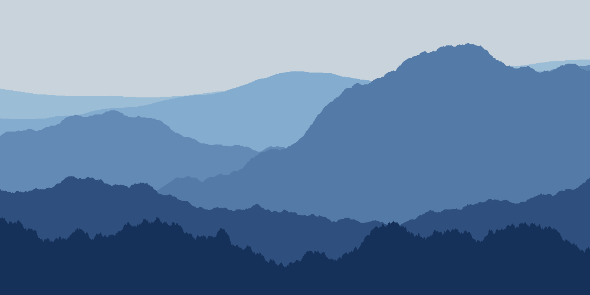
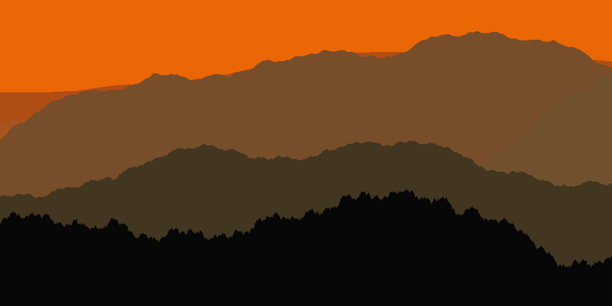

# 2d Landscape Generator

Based on https://bitesofcode.wordpress.com/2016/12/23/landscape-generation-using-midpoint-displacement/.

The generation algorithm involves iteratively computing midpoints in
a straight line segment, and vertically displacing the midpoints to
random offsets producing a line segment with pseudo-unpredictable
bend and turns throughout.

The generated line segment can then be sampled and drawn to create
varying aesthetic landscapes.

## Samples

Sample generated landscapes:

## Where to go from here?

Looking into procedurally generating moving wallpapers or screensavers, 
combining that with landscapes apart from simply rolling hill-like
structures.
